# WMS - Change Log Giao Diện Mới

Ngày kiểm tra: 21-07-2026

Tài liệu này so sánh giao diện WMS giữa:

- PRD: giao diện hiện tại, dùng làm mốc so sánh
- STG: giao diện mới đã được cập nhật

Phạm vi kiểm tra:

- PRD: đã login bằng tài khoản được cấp, chọn FC Sandbox, sau đó click toàn bộ menu/submenu trên UI.
- STG: đã login bằng tài khoản được cấp, chọn FC HN, sau đó click toàn bộ menu/submenu trên UI.
- Không truy cập màn hình bằng cách nhập URL trực tiếp sau khi login.
- PRD kiểm tra được 49 màn hình/menu.
- STG kiểm tra được 40 màn hình/menu.

## 1. Tóm tắt thay đổi chính

Giao diện mới trên STG không thay đổi toàn bộ nghiệp vụ cốt lõi, nhưng thay đổi mạnh cách tổ chức menu và tên gọi một số màn hình.

Các thay đổi lớn:

- Menu STG được gom lại theo luồng thao tác thực tế hơn: nhập kho, xử lý đơn hàng, lấy hàng/xuất kho, đóng gói, bàn giao, hàng hoàn, sản phẩm, kiểm kê, báo cáo.
- Các mục Nhân viên và Cấu hình kho trên PRD được gom vào một modal mới tên Quản trị & cấu hình.
- Nhóm Báo cáo trên STG được rút gọn đáng kể. Một số báo cáo chi tiết có trên PRD không còn xuất hiện trên menu STG.
- Một số màn hình vẫn còn nhưng được đổi tên để dễ hiểu hơn.
- Một màn báo cáo mới được đưa lên menu STG: Hiệu suất bàn đóng gói.

## 2. Tổng quan giao diện

| PRD - giao diện hiện tại | STG - giao diện mới |
| --- | --- |
| 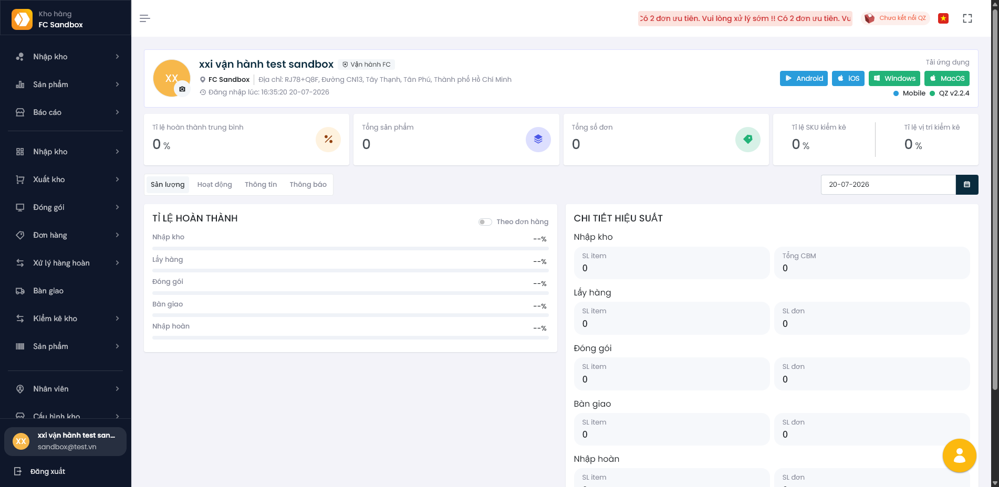 | 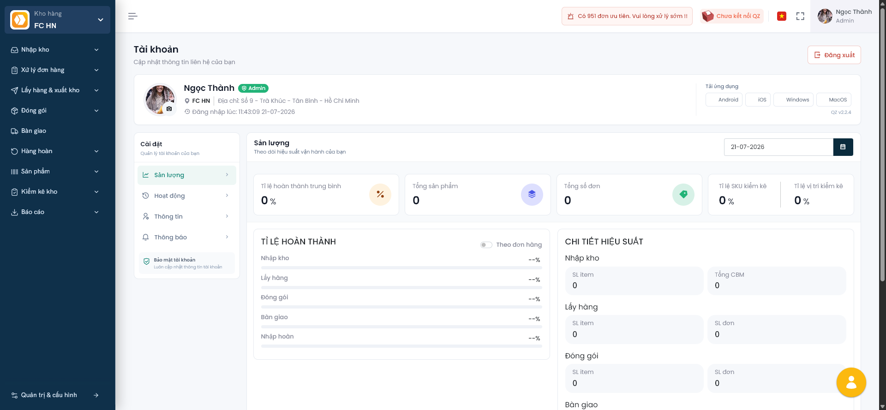 |

Điểm khác biệt dễ thấy:

- STG có menu trái gọn hơn, ít tầng báo cáo hơn.
- STG có khu vực chọn kho/FC rõ hơn ở đầu sidebar.
- Các màn quản trị/cấu hình không còn nằm rải rác trên menu trái mà mở qua modal Quản trị & cấu hình.
- Một số tên menu được đổi theo ngôn ngữ nghiệp vụ dễ hiểu hơn cho người dùng vận hành.

## 3. Các thay đổi người dùng cần chú ý

So với PRD, STG thay đổi nhiều nhất ở cách tổ chức menu. Thay vì giữ nhiều nhóm báo cáo và cấu hình riêng trên sidebar, giao diện mới gom lại thành các nhóm ngắn hơn.

Người dùng cần chú ý 3 điểm chính:

- Nhóm Báo cáo được rút gọn mạnh. Một số báo cáo chi tiết trên PRD không còn xuất hiện trực tiếp trên menu STG; danh sách chi tiết nằm ở mục 4.
- Nhóm Nhân viên và Cấu hình kho trên PRD được gom vào modal Quản trị & cấu hình ở cuối sidebar.
- Một số menu nghiệp vụ vẫn còn chức năng tương tự nhưng đổi tên để dễ hiểu hơn, ví dụ Chờ lưu kho đổi thành Chờ cất hàng, Không xác định đổi thành Đơn chưa xác định.

## 4. Thay đổi riêng ở nhóm Báo cáo

Trên PRD, phần báo cáo được chia thành nhiều nhóm riêng trên sidebar:

- Báo cáo nhập kho
- Báo cáo sản phẩm
- Báo cáo tổng hợp

Trên STG, các báo cáo còn sử dụng trên menu được gom lại vào một nhóm duy nhất là Báo cáo.

| PRD - nhóm/màn hình cũ | STG - tên mới trên menu Báo cáo | Tình trạng |
| --- | --- | --- |
| Báo cáo nhập kho / Theo PO | Báo cáo / Nhập kho theo PO | Còn trên menu, đổi tên rõ hơn |
| Báo cáo nhập kho / Theo thời gian | Không còn trên menu STG | Bị bỏ khỏi menu |
| Báo cáo sản phẩm / Theo hạn sử dụng | Không còn trên menu STG | Bị bỏ khỏi menu |
| Báo cáo sản phẩm / Theo ngày lưu kho | Không còn trên menu STG | Bị bỏ khỏi menu |
| Báo cáo sản phẩm / Theo lô lot | Không còn trên menu STG | Bị bỏ khỏi menu |
| Báo cáo sản phẩm / Theo khách hàng | Báo cáo / Tồn kho theo khách hàng | Còn trên menu, đổi tên theo nội dung báo cáo |
| Báo cáo sản phẩm / Báo cáo hàng hết hạn | Không còn trên menu STG | Bị bỏ khỏi menu |
| Báo cáo tổng hợp / Đơn hàng | Báo cáo / Báo cáo đơn hàng | Còn trên menu, đổi tên rõ hơn |
| Báo cáo tổng hợp / Lấy hàng | Không còn trên menu STG | Bị bỏ khỏi menu |
| Báo cáo tổng hợp / Đóng gói | Không còn trên menu STG | Bị bỏ khỏi menu |
| Báo cáo tổng hợp / Hàng hoàn trả | Không còn trên menu STG | Bị bỏ khỏi menu |
| Báo cáo tổng hợp / Kiểm kê kho | Không còn trên menu STG | Bị bỏ khỏi menu |
| Báo cáo tổng hợp / Sản lượng | Báo cáo / Sản lượng theo giờ | Còn trên menu, đổi tên rõ hơn |
| Báo cáo tổng hợp / Vị trí lưu kho | Báo cáo / Tỷ lệ lấp đầy kho | Còn trên menu, đổi tên theo chỉ số chính |
| Báo cáo tổng hợp / Tải file | Báo cáo / Trung tâm báo cáo | Còn trên menu, đổi tên thành khu vực tổng hợp |
| Không có trên menu PRD trong lần kiểm tra | Báo cáo / Hiệu suất bàn đóng gói | Màn mới/được đưa lên menu STG |

Tác động với người dùng:

- Người dùng không cần tìm báo cáo theo 3 nhóm cũ như PRD nữa.
- Trên STG, người dùng vào nhóm Báo cáo để xem các báo cáo còn được giữ lại.
- Các báo cáo không còn trên menu cần được xác nhận lại là đã bỏ hẳn, chuyển vào Trung tâm báo cáo, hoặc thay bằng báo cáo khác.

## 5. Các màn hình nghiệp vụ/cấu hình đổi tên hoặc chuyển vị trí

Các màn dưới đây vẫn còn trên STG, nhưng tên menu hoặc vị trí menu đã thay đổi. Riêng các thay đổi thuộc nhóm Báo cáo đã được gom trong mục 4 để tránh lặp lại.

| PRD - tên/vị trí cũ | STG - tên/vị trí mới | Ý nghĩa thay đổi |
| --- | --- | --- |
| Đơn hàng / Danh sách | Xử lý đơn hàng / Danh sách | Đổi tên nhóm để nhấn mạnh thao tác xử lý đơn |
| Đơn hàng / Không xác định | Xử lý đơn hàng / Đơn chưa xác định | Đổi tên rõ nghĩa hơn |
| Xuất kho / Tạo yêu cầu | Lấy hàng & xuất kho / Tạo yêu cầu xuất | Đổi tên nhóm và tên màn hình |
| Xuất kho / Danh sách | Lấy hàng & xuất kho / Danh sách yêu cầu xuất | Đổi tên rõ hơn |
| Nhập kho / Kiểm hàng | Nhập kho / Kiểm hàng nhập | Làm rõ đây là kiểm hàng nhập |
| Nhập kho / Chờ lưu kho | Nhập kho / Chờ cất hàng | Đổi cách gọi theo nghiệp vụ cất hàng |
| Xử lý hàng hoàn / Đơn chờ nhận | Hàng hoàn / Đơn hoàn chờ nhận | Rút gọn nhóm menu |
| Xử lý hàng hoàn / Phiếu nhận hoàn | Hàng hoàn / Danh sách phiếu hoàn | Đổi tên dễ hiểu hơn |
| Xử lý hàng hoàn / Hàng đã kiểm | Hàng hoàn / Hàng hoàn đã kiểm | Làm rõ đối tượng là hàng hoàn |
| Kiểm kê kho / Có vấn đề | Kiểm kê kho / Sai lệch tồn kho | Đổi tên rõ nghĩa hơn |
| Sản phẩm / Điều chỉnh tồn kho | Sản phẩm / Điều chỉnh tồn | Rút gọn tên |
| Sản phẩm / Điều chỉnh vị trí | Sản phẩm / Chuyển vị trí | Đổi tên theo hành động |
| Nhân viên / Danh sách | Quản trị & cấu hình / Danh sách | Chuyển vào modal Quản trị & cấu hình |
| Nhân viên / Phân quyền | Quản trị & cấu hình / Phân quyền | Chuyển vào modal Quản trị & cấu hình |
| Nhân viên / Cấu hình KPI | Quản trị & cấu hình / Cấu hình KPI | Chuyển vào modal Quản trị & cấu hình |
| Cấu hình kho / Bàn đóng gói | Quản trị & cấu hình / Bàn đóng gói | Chuyển vào modal Quản trị & cấu hình |
| Cấu hình kho / Vị trí lưu kho | Quản trị & cấu hình / Vị trí lưu kho | Chuyển vào modal Quản trị & cấu hình |
| Cấu hình kho / Đơn vị lấy hàng | Quản trị & cấu hình / Đối tác vận chuyển | Đổi tên và chuyển vào modal |
| Cấu hình kho / Cấu hình SLA | Quản trị & cấu hình / Cấu hình SLA | Chuyển vào modal Quản trị & cấu hình |
| Cấu hình kho / Cấu hình lấy hàng | Quản trị & cấu hình / Cấu hình lấy hàng | Chuyển vào modal Quản trị & cấu hình |
| Cấu hình kho / Thiết bị chứa hàng | Quản trị & cấu hình / Thiết bị kho | Đổi tên và chuyển vào modal |

## 6. Các màn hình vẫn giữ trong hệ thống

Các nghiệp vụ chính vẫn còn trên STG, gồm nhập kho, xử lý đơn hàng, lấy hàng & xuất kho, đóng gói, bàn giao, hàng hoàn, sản phẩm, kiểm kê kho và quản trị/cấu hình.

Điểm thay đổi chủ yếu là tên menu, vị trí truy cập và cách gom nhóm. Người dùng có thể dùng bảng ở mục 5 để tra nhanh vị trí cũ trên PRD và vị trí mới trên STG.

## 7. Một số màn hình thay đổi UI rõ rệt

### 7.1 Danh sách đơn hàng

| PRD | STG |
| --- | --- |
| 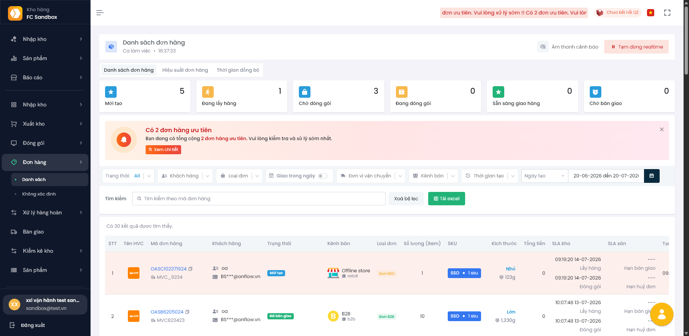 | 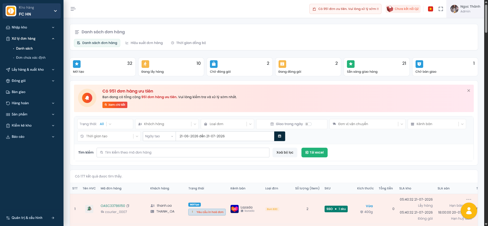 |

Thay đổi chính:

- Trên STG, màn hình nằm trong nhóm Xử lý đơn hàng.
- Khu vực trạng thái và cảnh báo được hiển thị nổi bật hơn.
- Cách sắp xếp bộ lọc và bảng dữ liệu gọn hơn.

### 7.2 Danh sách yêu cầu xuất

| PRD | STG |
| --- | --- |
| 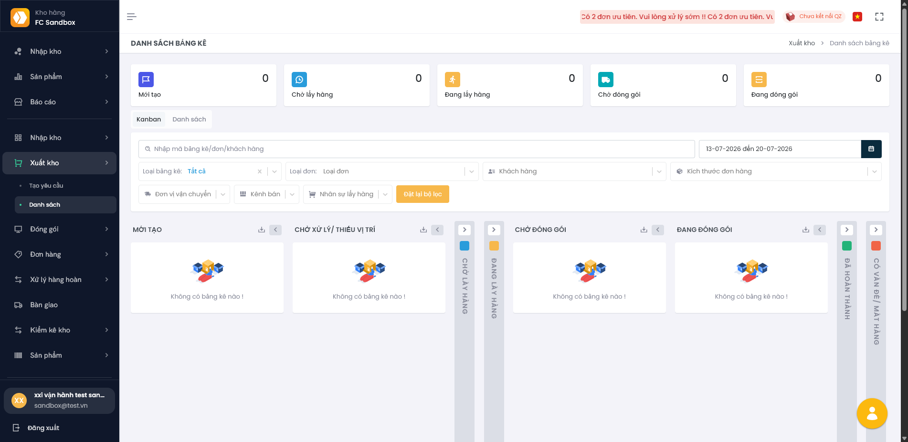 | 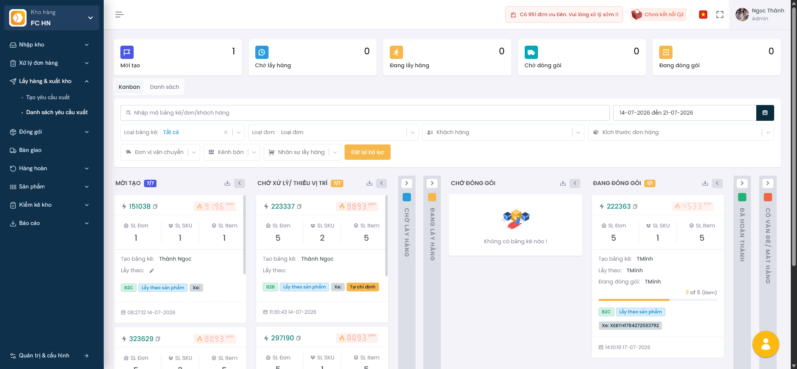 |

Thay đổi chính:

- Tên menu đổi từ Xuất kho / Danh sách sang Lấy hàng & xuất kho / Danh sách yêu cầu xuất.
- STG thể hiện trạng thái yêu cầu xuất trực quan hơn.
- Người dùng dễ phân biệt bước mới tạo, chờ xử lý, chờ đóng gói, đang đóng gói.

### 7.3 Đóng gói Campaign

| PRD | STG |
| --- | --- |
| 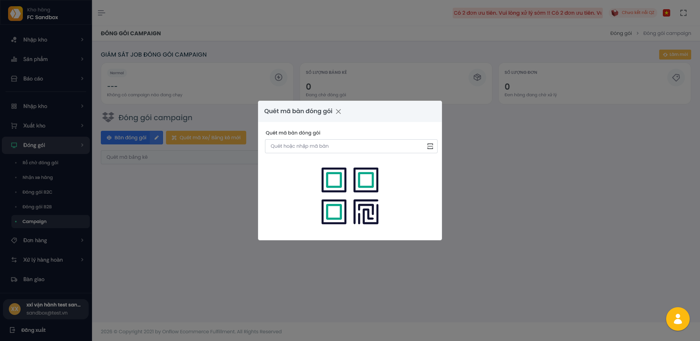 | 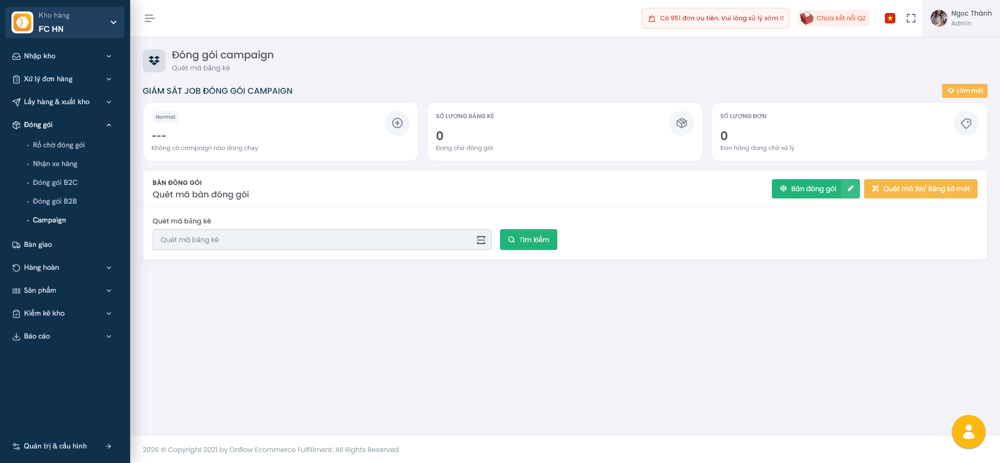 |

Thay đổi chính:

- Luồng thao tác chính vẫn giữ: quét bàn đóng gói, nhận bảng kê, xử lý đóng gói.
- Giao diện STG được sắp xếp lại theo layout mới.
- Màn hình vẫn nằm trong nhóm Đóng gói.

### 7.4 Danh sách sản phẩm

| PRD | STG |
| --- | --- |
| 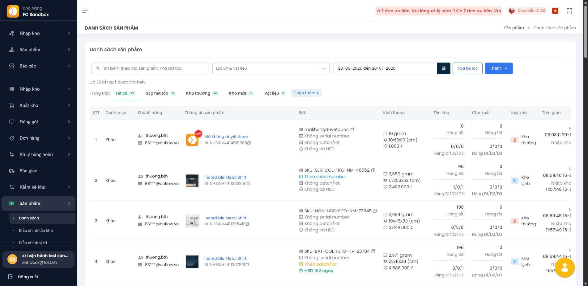 | 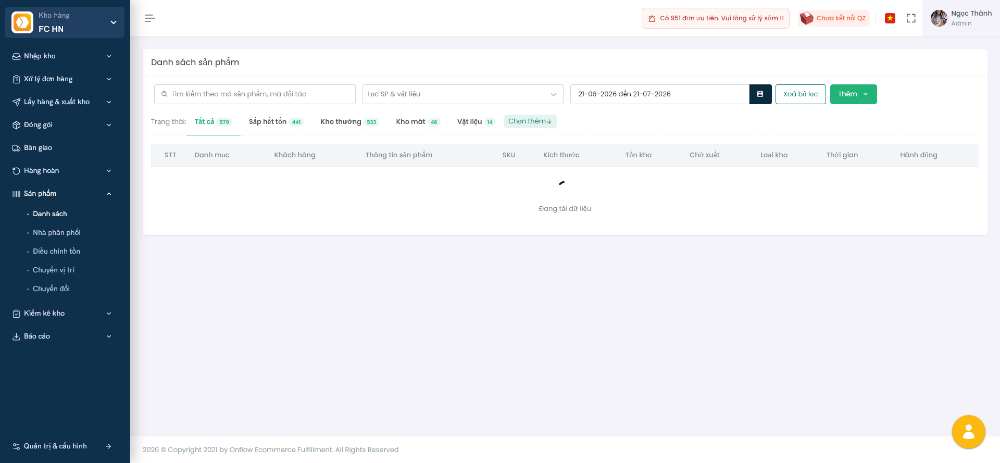 |

Thay đổi chính:

- Chức năng danh sách sản phẩm vẫn còn.
- UI top bar, sidebar và style nút thay đổi theo giao diện mới.
- Các thao tác lọc/tìm kiếm vẫn tương tự.

### 7.5 Thiết bị kho

| PRD | STG |
| --- | --- |
| 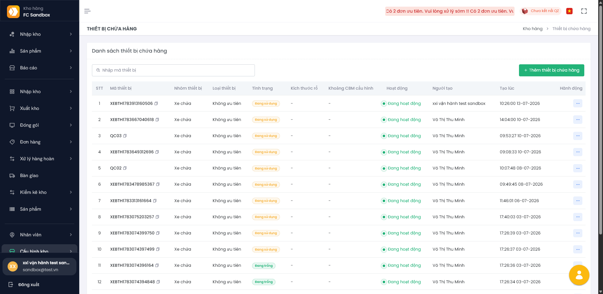 | 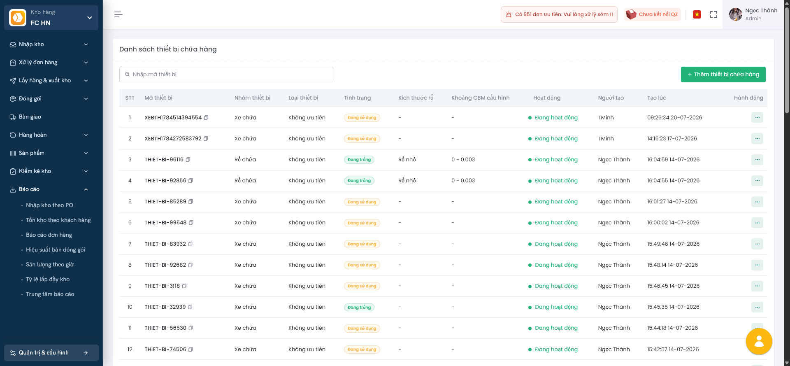 |

Thay đổi chính:

- Tên cũ trên PRD là Thiết bị chứa hàng.
- Tên mới trên STG là Thiết bị kho.
- Màn hình được chuyển vào modal Quản trị & cấu hình.

### 7.6 Quản trị & cấu hình

Trên PRD, nhóm Nhân viên và Cấu hình kho nằm trực tiếp ở sidebar. Trên STG, các chức năng này được gom vào modal Quản trị & cấu hình.

| STG - modal Quản trị & cấu hình |
| --- |
| 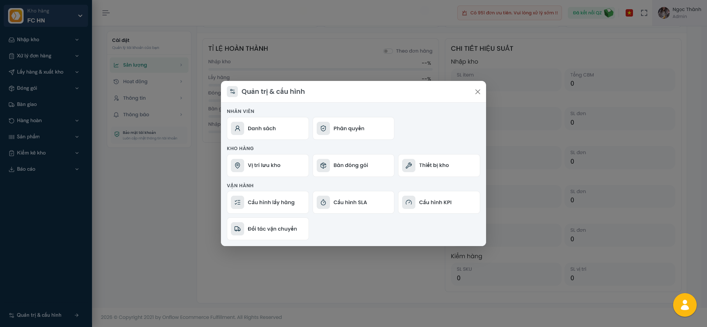 |

Các nhóm trong modal:

- Nhân viên: Danh sách, Phân quyền
- Kho hàng: Vị trí lưu kho, Bàn đóng gói, Thiết bị kho
- Vận hành: Cấu hình lấy hàng, Cấu hình SLA, Cấu hình KPI, Đối tác vận chuyển

Tác động với người dùng:

- Người dùng không tìm các mục này trực tiếp trên sidebar nữa.
- Cần click Quản trị & cấu hình ở cuối sidebar, sau đó chọn card chức năng trong modal.
- Đây là thay đổi về vị trí truy cập, không phải bỏ chức năng.

## 8. Người dùng cần thay đổi thói quen gì

Khi chuyển sang giao diện mới, nên truyền thông cho user theo 4 ý ngắn:

- Khi cần báo cáo, vào nhóm Báo cáo trên STG thay vì tìm theo 3 nhóm báo cáo cũ trên PRD.
- Khi cần cấu hình kho hoặc nhân viên, vào Quản trị & cấu hình ở cuối sidebar.
- Khi không thấy một báo cáo chi tiết như PRD, kiểm tra Trung tâm báo cáo hoặc liên hệ team vận hành/sản phẩm để xác nhận báo cáo thay thế.
- Với các menu đổi tên, nên dùng tên STG mới trong hướng dẫn nội bộ sau release.

## 9. Kết luận

STG là bản giao diện WMS mới, tập trung vào việc rút gọn menu và gom chức năng theo nhóm nghiệp vụ. Thay đổi lớn nhất nằm ở:

- Cách tổ chức menu
- Nhóm báo cáo bị rút gọn
- Nhóm quản trị/cấu hình được chuyển sang modal riêng
- Một số tên màn hình được đổi để dễ hiểu hơn

Trước khi release cho người dùng, nên truyền thông rõ danh sách báo cáo không còn trên menu STG và hướng dẫn người dùng vị trí mới của nhóm Quản trị & cấu hình.
